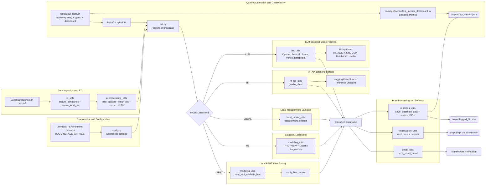

# Architecture Overview

This document explains how the automation-of-feasibility-categorization project is structured, the responsibilities of each layer, and how the automated tests and dashboards reinforce the delivery pipeline.

## Diagram

The following Mermaid diagram is the canonical view (also stored under `design/architecture.mmd`):

## Layer Responsibilities

### Environment and Configuration
- `.env.local` holds secrets (HUGGINGFACE_API_KEY, SMTP credentials, etc.) that feed into `package/python/config.py`.
- `config.py` normalizes all settings (model backends, prompt templates, data paths, email toggles), making the rest of the pipeline environment-agnostic.

### Data Ingestion and Preparation
- Files dropped into `inputs/` are discovered by `io_utils.resolve_input_file`.
- `preprocessing_utils` validates required columns, normalizes labels, downloads NLTK resources, and produces `texto_bruto`/`texto_limpo` fields used by every backend.

### Orchestration and Modeling
- `aut.py` orchestrates the whole run:
  1. Resolve input and prepare the dataframe.
  2. Choose a backend based on `MODEL_BACKEND`.
  3. Invoke the backend-specific module:
     - **HF API** via `hf_api_utils`.
     - **Hosted LLM** via `llm_utils` (Cross-platform calls to Hugging Face Inference, AWS Bedrock proxies, Azure OpenAI, Vertex AI routers, Databricks Serving, litellm, etc.). Configure `LLM_BASE_URL`, `LLM_API_KEY`, and `LLM_MODEL` to switch providers without code changes.
     - **Fine-tuned BERT** via `modeling_utils` training + inference helpers.
     - **Classical ML** (BoW/TF-IDF + Logistic Regression).
     - **Local transformers** via `local_model_utils`.
  4. Persist the enriched dataframe and metrics.

### Post-processing and Delivery
- `reporting_utils` writes the Excel output and stores a JSON summary (`outputs/nlp_metrics.json`) that includes backend info, vectorizer scores, and feature-importance data.
- `visualization_utils` generates word clouds and distribution plots under `output/nlp_visualizations/`.
- `email_utils` can notify stakeholders with the tagged Excel file.
- `save_dashboard_report.py` merges the metrics JSON + classified Excel to produce the dark-mode HTML report (`output/dashboard_report.html`), useful for quick sharing.

- **Tests**: Each module ships with Python unit tests executed via `python -m pytest --json-report --json-report-file output/test_results.json`, which yields a machine-readable summary consumed by dashboards/CI.
- **Automation script**: `robots/aut_tests.sh` ensures `.venv` exists, installs dependencies, runs pytest (producing the JSON report), triggers the report generator, and launches the Streamlit dashboard once tests pass.
- **Dashboard**: `package/python/test_metrics_dashboard.py` now loads both `outputs/nlp_metrics.json` and `output/test_results.json`, rendering backend metadata, vectorizer accuracy, classification reports/feature importance (when available), and the latest pytest outcomes. This gives stakeholders a consolidated health view after every run.

### Artifacts and Traceability
- `output/tagged_file.xlsx` – final classified dataset.
- `outputs/nlp_metrics.json` – machine-readable metrics consumed by the dashboard.
- `output/nlp_visualizations/` – word clouds and distribution charts for exploration.

## How the Tests and Dashboard Fit Together
1. **Developers** run `bash robots/aut_tests.sh` (or `python -m pytest`) before committing changes.
2. If tests pass, `aut_tests.sh` launches the Streamlit dashboard in headless mode so the latest metrics are visible.
3. Stakeholders or QA open the dashboard URL to inspect the same JSON summary that was produced by `reporting_utils`.
4. Any regression (e.g., drop in vectorizer accuracy) is visible both in the pytest output and the dashboard visualization, tightening the feedback loop.

This process ensures the architecture stays maintainable, observable, and verifiable at every iteration.
